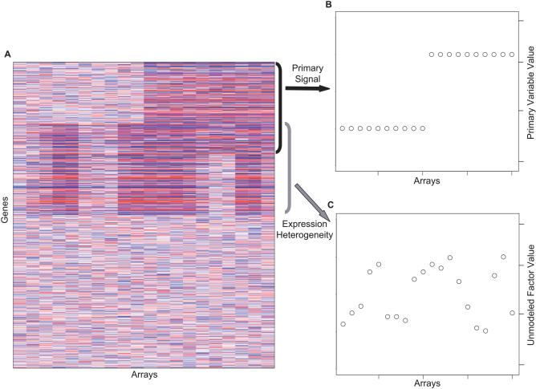

## Gene Expression Studies

- Characterize transcriptional variability
- Models fail to include unmodeled or unmeasured factors
- Noise can lead to a decrease power in detecting association

So, how do we handle background noise?


##Expression Heterogeneity (EH)

- Describes patterns of variation due to unmodeled factors
- Commonly expressed in human expression data and complex systems
- Sources include technical, environmental, demographic, genetic factors, etc.



##Proposed Solution: Surrogate Variable Analysis (SVA)

- Identifies, estimates, and utilizes the components of EH
- Improves accuracy and consistency in detecting differential expression
- Captures signatures of EH and uses them as covariates in differential expression analysis


##Algoirthm Overview: Step 1
- Remove the signal due to the primary variables to obtain a residual expression matrix
    - Form estimates $\hat{\mu_i}$ and $\hat{f_i}$ by fitting the model to $x_{ij} = \mu_i + f_i(y_j) + e_{ij}^*$
    - Caclulate residual expression matrix $R$ where (i,j) element is $r_{ij}$   
    $r_{i,j} = x_{ij} - \hat{\mu_i} +\hat{f_i}(y_{j})$
    
## Step 1 Continuted
- Apply a decomposition to the residual expression matrix to identify signatures of EH 
    - $d_l$ is the lth orthogonal signatures of EH, "eigenvalue"   
    - $k$ is a gene corresponding to the signatures of EH, "eigengene"    
    - Calculate a null statistic for each gene   
    $$T_k = \dfrac{d_k^2}{\sum_{l=1}^{n-df} d_{0l}^2}$$
- Use a statistical test to determine the singular vectors that represent more variation than is expected by chance    
    - calculate a p-value for the eigengene k    
    $$p_k = \dfrac{\#{T_k^{0b} >= T_k; b = 1,...,B}}{B}$$


## Algorithm Overview: Step 2

- Identify subset of genes driving each signature
- Run an association analysis between factors and genes.

## Algorithm Overview: Step 3

- For each subset of genes, build a surrogate variable based on the full EH signature
- Build matrix containing all genes associated with the residual eigengene

## Algorithm Overview: Step 4

- Include all surrogate variables as covariates in subsequent regression analysis

$$x_{ij} = \mu_i + f_i(y_j) + \sum_{k=1}^K \gamma_{ki}\hat{h_{kj}} + e_{ij}$$


---
title: "Analysis"
output: 
  ioslides_presentation:
    fig_retina: 1
    smaller: yes
    fig_height: 5
    fig_width: 7
---

##Gene-Expression Profiles in Hereditary Breast Cancer

Hedenfalk I, Duggan D, Chen Y, et al. Gene-expression profiles in hereditary breast cancer. N Engl J Med. 2001 Feb 22;344(8):539-48.

##Background
- BRCA1 and BRCA2 contribute to many cases of hereditary breast cancer

- Mutation confers a lifetime risk of breast cancer of 50-85% and ovarian cancer of 15-45%

- BRCA1 and BRCA2 proteins participate in DNA repair and homologous recombination

- Tumors with BRCA1 and BRCA2 mutations have different pathological features

##BRCA1 vs. BRCA2
BRCA1

- High-grade cancers with high mitotic index
- "Pushing" tumor margins
- Lymphocytic infiltrate

BRCA2

- Heterogeneous
- Often relatively high-grade
- Display substantially less tubul formation

##Study Sample
- Patients with primary breast cancer
- Family history of breast and/or ovarian cancer
- Referred to Oncogenetic Clinic of Lund University Hospital
- Seven BRCA1 and 9 BRCA2 participants

##Microarray
- Obtained samples of complementary DNA with verified sequences  according to build 100 of UniGene human-sequence collection
- 6,512 cDNAs represent 5,361 unique genes
- 3,226 passed quality control criteria for average intensity levels and spot areas

##Statistical Analysis
- Differential gene expression analysis for BRCA1 or BRCA2 mutation
- Use LIMMA
- Use SVA to estimate latent batch effects
- Compare results with and without SVA

##Load Libraries
Load Libraries
```{r}
#source("http://bioconductor.org/biocLite.R")
#biocLite("Biobase")
#biocLite("limma")
#biocLite("sva")
#install.packages("data.table")
library(Biobase)
library(limma)
library(data.table)
library(sva)
library(ggplot2)
library(pheatmap)
```
##Read in BRCA data
```{r}
brca <- read.csv("./BRCA.csv", header=T)
#Get participant data
pheno <- brca[1:2,]
rownames(pheno) <- pheno[,1]
pheno <- pheno[,4:25]
pheno <- t(pheno)
pheno <- as.data.frame(pheno)
pheno$ptid <- rownames(pheno)
pheno$ptid <- gsub("^[A-Z]","", rownames(pheno))
class(pheno$ptid) <- "numeric"
pheno[10,3] <- 15
#Get expression matrix
ematrix <- as.matrix(brca[3:3228, 4:25])
class(ematrix) <- "numeric"
#Get annotation data
annot <- brca[3:3228, 1:3]
colnames(annot)<- c("PlatePosition", "ImageCloneID", "Title")
annot$ImageCloneID <- as.numeric(as.character(annot$ImageCloneID))
#Set row names for expression matrix
rownames(ematrix) <- annot$ImageCloneID

#Drop all ppt with "Sporadic" mutations
pheno <- pheno[pheno$Mutation=="BRCA1" | pheno$Mutation=="BRCA2",]
ematrix <- ematrix[, row.names(pheno),drop=FALSE]
all(rownames(pheno)==colnames(ematrix))
dim(ematrix)
```
##Differential Expression by BRCA
```{r}
design <- model.matrix(~Mutation,pheno)
design <- design[,1:2,drop=FALSE]
fit <- lmFit(ematrix, design)
eb <- eBayes(fit, robust=T)
tt <- topTable(eb , coef="MutationBRCA2", number=Inf, adjust.method="BH")
sum(tt$adj.P.Val<0.05) #23
annot <- annot[order(annot$ImageCloneID),]
tt$ID <- as.numeric(tt$ID)
tt <- tt[order(tt$ID),]
all(annot$ImageCloneID==tt$ID)
tt_annot<-cbind(annot, tt)
write.table(tt_annot, "./tt_annot.txt", sep="\t")
```
##Run SVA
```{r}
design0 <- model.matrix(~1, pheno)
n.sv <- num.sv(ematrix,design, method="be")
n.sv #1
#Chose 2-step as method described originally described in paper, but there are newer methods now
svobj <- sva(ematrix,design,design0,n.sv=n.sv, method="two-step")

```
##Run LIMMA and include SV
```{r}
designSv <- cbind(design,svobj$sv)
pheno$sv <- svobj$sv
fitSv <- lmFit(ematrix,designSv)
ebSv <- eBayes(fitSv, robust=T)
ttSv <- topTable(ebSv , coef="MutationBRCA2", number=Inf, adjust.method="BH")
sum(ttSv$adj.P.Val<0.05) #21
ttSv$ID <- as.numeric(ttSv$ID)
ttSv <- ttSv[order(ttSv$ID),]
all(annot$ImageCloneID==ttSv$ID)
ttSv_annot<-cbind(annot, ttSv)
write.table(ttSv_annot, "./ttSv_annot.txt", sep="\t")
```
##Visualize Data - Heat Map
```{r}
#Reorder pheno
pheno <- pheno[ order(pheno$ptid) , ]
ematrix <- ematrix[,rownames(pheno),drop=FALSE]
drows <- dist(ematrix, method = "euclidean")
hmcols<-colorRampPalette(c("red", "white", "blue"))(20)
```

##Visualize Data - Heat Map
```{r, echo=FALSE}
pheatmap(ematrix, cluster_cols=FALSE, cluster_rows=TRUE, 
         clustering_method="ward.D2", clustering_distance_rows = drows, 
         scale="row", show_rownames=FALSE, border_color=NA, treeheight_row=0, 
         color = hmcols) 
```

##Visualize Data - Plot of SV
```{r}
qplot(pheno$ptid, sv, data = pheno, color = Mutation)
```

##Plot pf EIF2S2 probes

```{r}
EIF2S2 <- ematrix[rownames(ematrix)==41511,]
EIF2S2 <- t(EIF2S2)
pheno$EIF2S2_1 <- EIF2S2[, 1]
pheno$EIF2S2_2 <- EIF2S2[,2]
```

##Plot of first EIF2S2 probe
```{r}
qplot(pheno$ptid, pheno$EIF2S2_1, data = pheno, color = Mutation)
```

##Plot of first EIF2S2 probe
```{r}
qplot(pheno$ptid, pheno$EIF2S2_2, data = pheno, color = Mutation)
```


##Questions?


##Extra
Generality Model $x_{ij} = \mu_{i} + f_{i}(y_{j} + e_{ij})$

$\gamma_{li}$ = gene-specific coefficient for the lth unmodeled factor

Expression for gene i on array j $x_{ij} = \mu_{i} + f_{i}(y_{j} + \sum_{l=1}^L \gamma_{li}g_{li}+ e_{ij}^*)$

 Remove signal of primary variables creating a residual expression matrix

- Normalized expression matrix $X_{mxn} = (x_{1},...,x_{m})^{T}$

- Vector representing primary variable of interest $y = (y_{1},...,y_{n})^{T}$

- Baseline level of expression $\mu$

$$
\begin{aligned}
x_{ij} = \mu_{i} + f_{i}(y_{j} + \sum_{l=1}^L \gamma_{li}g_{li}+ e_{ij}^*)
\end{aligned}
$$
$$
\begin{aligned}
x_{ij} = \mu_{i} + f_{i}(y_{j} + \sum_{k=1}^K \gamma_{ki}g_{ki}+ e_{ij}^*)
\end{aligned}
$$

